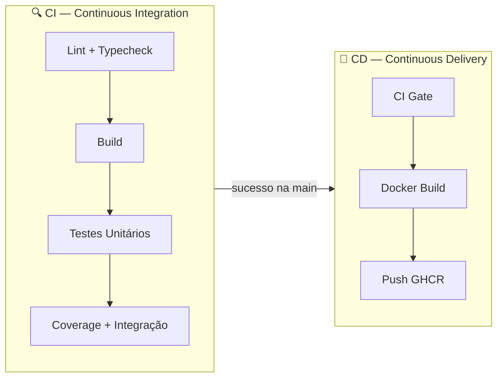
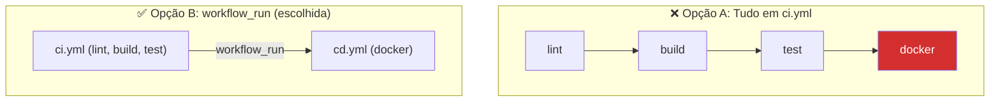
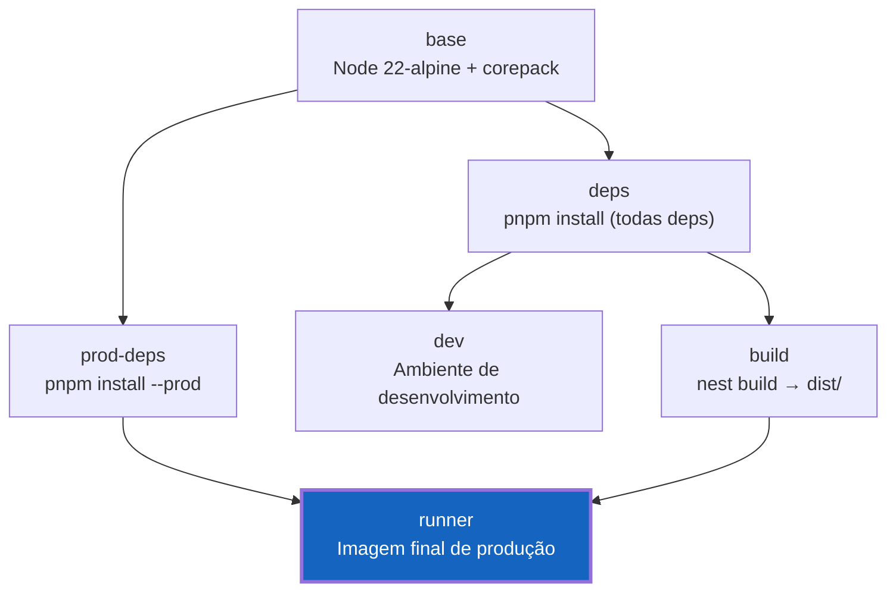
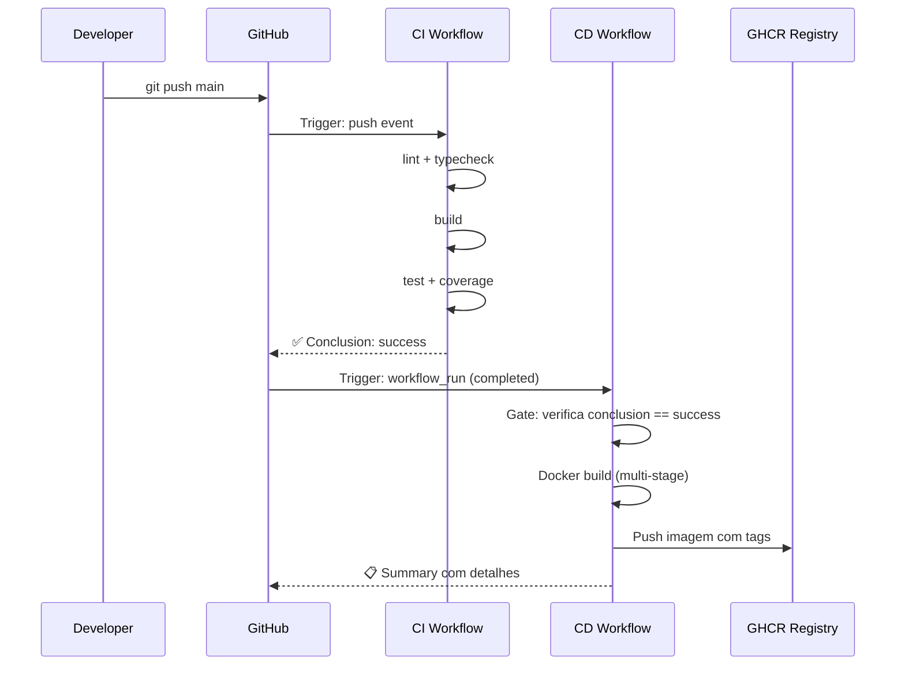
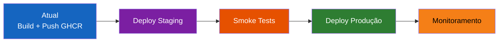

# Continuous Delivery (CD) — MarketPlace Backend

> Documentação completa do pipeline de Continuous Delivery do projeto MarketPlace Backend (DK Fashion).

---

## Sumário

- [1. O que é o CD implementado](#1-o-que-é-o-cd-implementado)
- [2. Diferença entre CI e CD](#2-diferença-entre-ci-e-cd)
- [3. Fluxo do Pipeline](#3-fluxo-do-pipeline)
- [4. Quando o Build/Deploy ocorre](#4-quando-o-builddeploy-ocorre)
- [5. Tecnologias utilizadas](#5-tecnologias-utilizadas)
- [6. Estrutura do Workflow](#6-estrutura-do-workflow)
- [7. Docker — Explicação detalhada](#7-docker--explicação-detalhada)
- [8. Triggers do GitHub Actions](#8-triggers-do-github-actions)
- [9. Como executar localmente](#9-como-executar-localmente)
- [10. Como evoluir o pipeline](#10-como-evoluir-o-pipeline)
- [11. Referências](#11-referências)

---

## 1. O que é o CD implementado

O pipeline de **Continuous Delivery** automatiza o processo de empacotamento da aplicação em uma imagem Docker de produção e sua publicação no **GitHub Container Registry (GHCR)**.

O CD **não duplica** responsabilidades do CI — ele assume que o código já foi validado (lint, typecheck, testes, coverage) e se concentra exclusivamente na entrega do artefato final.

### O que o CD faz

| Etapa | Descrição |
|---|---|
| **Gate** | Verifica se o CI concluiu com sucesso |
| **Docker Build** | Constrói a imagem de produção com multi-stage build |
| **Push para GHCR** | Publica a imagem com tags semânticas |
| **Resumo** | Gera um summary no GitHub Actions com os detalhes da publicação |

---

## 2. Diferença entre CI e CD



| Aspecto | CI | CD |
|---|---|---|
| **Objetivo** | Validar qualidade do código | Empacotar e entregar artefato |
| **Quando executa** | Push e PR em `dev` e `main` | Somente após CI bem-sucedido na `main` |
| **O que verifica** | Lint, types, testes, coverage | — |
| **O que produz** | Relatório de coverage | Imagem Docker publicada |
| **Falha significa** | Código com problemas | Falha no empacotamento |

> **Princípio:** O CI é o guardião da qualidade. O CD é o entregador — ele confia no CI.

---

## 3. Quando o Build/Deploy ocorre

O CD é acionado **exclusivamente** quando:

1. Um **push** é feito na branch `main`
2. O **CI completa com sucesso** para esse push
3. O GitHub Actions dispara o evento `workflow_run`

### Cenários

| Cenário | CI roda? | CD roda? |
|---|---|---|
| Push na `dev` | ✅ | ❌ |
| PR para `main` | ✅ | ❌ |
| Push na `main` + CI falha | ✅ | ❌ |
| Push na `main` + CI passa | ✅ | ✅ |
| Tag semver na `main` + CI passa | ✅ | ✅ (com tags de versão) |

### Tags geradas na imagem

| Tipo | Exemplo | Quando |
|---|---|---|
| `latest` | `ghcr.io/org/repo:latest` | Todo push na `main` |
| `sha-*` | `ghcr.io/org/repo:sha-a1b2c3d` | Todo push na `main` |
| `semver` | `ghcr.io/org/repo:1.2.3` | Quando há tag git `v1.2.3` |

---

## 4. Tecnologias utilizadas

| Tecnologia | Propósito | Versão |
|---|---|---|
| **GitHub Actions** | Plataforma de CI/CD | v2 (workflow syntax) |
| **Docker** | Containerização da aplicação | Buildx multi-platform |
| **GHCR** | Registry de imagens Docker | Integrado ao GitHub |
| **Node.js** | Runtime da aplicação | 22-alpine |
| **pnpm** | Gerenciador de pacotes | 10.33.0 |
| **NestJS** | Framework backend | Dockerfile multi-stage |

### Actions utilizadas

| Action | Versão | Propósito |
|---|---|---|
| `actions/checkout` | v4 | Checkout do código |
| `docker/setup-buildx-action` | v3 | Setup do Buildx para cache avançado |
| `docker/login-action` | v3 | Autenticação no GHCR |
| `docker/metadata-action` | v5 | Geração automática de tags e labels |
| `docker/build-push-action` | v6 | Build e push da imagem |

---

## 5. Estrutura do Workflow

```yaml
# Estrutura simplificada do cd.yml
name: CD

on:
  workflow_run:           # Trigger encadeado
    workflows: ["CI"]     # Nome exato do CI
    types: [completed]    # Quando CI finaliza
    branches: [main]      # Somente na main

permissions:
  contents: read          # Checkout
  packages: write         # Push GHCR

jobs:
  gate:                   # Verifica se CI passou
    if: conclusion == 'success'

  docker:                 # Build + Push
    needs: gate
    steps:
      - checkout          # SHA exato do CI
      - setup-buildx      # Cache avançado
      - login             # GHCR auth
      - metadata          # Tags automáticas
      - build-push        # Build + Push com cache
      - summary           # Resumo no Actions
```

### Decisões Arquiteturais

#### Por que `workflow_run` em vez de `needs` no mesmo arquivo?



| Critério | Mesmo arquivo | `workflow_run` (escolhido) |
|---|---|---|
| Separação de responsabilidades | ❌ Misturado | ✅ Limpo |
| CI roda em PRs sem acionar CD | ❌ Precisa de condicionais | ✅ Natural |
| Permissões | ⚠️ Precisa de `packages:write` no CI | ✅ Cada um com suas permissões |
| Evolução independente | ❌ Acoplado | ✅ Independente |

#### Por que cache GHA (GitHub Actions) para Docker?

- O cache `type=gha` usa o storage nativo do GitHub Actions
- Não precisa de registry externo para cache
- `mode=max` exporta todas as layers intermediárias para máximo reaproveitamento
- Builds subsequentes são significativamente mais rápidos

---

## 6. Docker — Explicação detalhada

### Multi-stage Build

O Dockerfile utiliza um build multi-stage com 5 estágios:



| Estágio | Propósito | Presente na imagem final? |
|---|---|---|
| `base` | Imagem base com Node.js e corepack | Sim (base) |
| `deps` | Instala todas as dependências | Não |
| `dev` | Ambiente de desenvolvimento | Não |
| `prod-deps` | Instala apenas deps de produção | Sim (node_modules) |
| `build` | Compila TypeScript → JavaScript | Sim (dist/) |
| **`runner`** | **Imagem final otimizada** | **Sim** |

### Imagem Final (`runner`)

A imagem de produção contém apenas:

```
/app
├── dist/           # Código compilado (JavaScript)
├── node_modules/   # Apenas dependências de produção
└── package.json    # Metadados do pacote
```

**Características de segurança:**

- Roda como usuário não-root (`nestjs:nodejs`)
- Base Alpine (superfície de ataque mínima)
- Healthcheck embutido (endpoint `/api/health`)
- Sem código-fonte TypeScript, testes ou ferramentas de dev

### Docker Compose — Ambientes

| Arquivo | Ambiente | Target | Uso |
|---|---|---|---|
| `compose.dev.yml` | Desenvolvimento | `dev` | Hot-reload, volumes, debug |
| `compose.prod.yml` | Produção | `runner` | Imagem otimizada, sem volumes |

---

## 7. Triggers do GitHub Actions

### CI — Triggers

```yaml
on:
  pull_request:
    branches: [dev, main]    # Valida PRs antes do merge
  push:
    branches: [dev, main]    # Valida pushes diretos
```

### CD — Trigger

```yaml
on:
  workflow_run:
    workflows: ["CI"]        # Encadeia com o CI
    types: [completed]       # Quando o CI finaliza (sucesso ou falha)
    branches: [main]         # Somente na branch main
```

> **Importante:** O `workflow_run` dispara quando o CI **finaliza** (não necessariamente com sucesso). Por isso o job `gate` verifica explicitamente `conclusion == 'success'`.



---

## 8. Como executar localmente

### Pré-requisitos

- Docker Desktop ou Docker Engine instalado
- Acesso ao repositório

### Build local da imagem de produção

```bash
# Build simples da imagem de produção
docker build --target runner -t marketplace-backend:local .

# Build com verificação de sintaxe do Dockerfile
docker build . --check

# Build via Makefile (recomendado)
make prod-build
```

### Rodando a imagem localmente

```bash
# Via Docker direto
docker run --rm -p 3000:3000 \
  -e NODE_ENV=production \
  -e PORT=3000 \
  -e POSTGRES_HOST=host.docker.internal \
  -e POSTGRES_PORT=5432 \
  -e POSTGRES_USER=seu_user \
  -e POSTGRES_PASSWORD=sua_senha \
  -e POSTGRES_DB=seu_banco \
  -e JWT_SECRET=$(openssl rand -base64 32) \
  marketplace-backend:local

# Via Docker Compose (recomendado)
make prod-up
```

### Simulando o pipeline completo localmente

```bash
# 1. Rodar CI localmente
make lint                    # Lint
pnpm typecheck               # Typecheck
pnpm build                   # Build
pnpm test                    # Testes unitários
pnpm test:cov                # Coverage

# 2. Se tudo passou, buildar imagem Docker
docker build --target runner -t marketplace-backend:local .

# 3. Verificar que a imagem funciona
docker run --rm marketplace-backend:local node -e "console.log('OK')"
```

### Testando com o act (GitHub Actions local)

```bash
# Instalar o act (https://github.com/nektos/act)
# O act simula GitHub Actions localmente

# Listar workflows disponíveis
act -l

# Rodar apenas o build Docker (sem push)
act workflow_run -W .github/workflows/cd.yml --dryrun
```

---

## 10. Como evoluir o pipeline

### Próximos passos sugeridos



### 1. Deploy automático para staging

Adicione um job ao `cd.yml` para deploy automático:

```yaml
deploy-staging:
  name: Deploy to Staging
  needs: docker
  runs-on: ubuntu-latest
  environment: staging       # GitHub Environment com proteção
  steps:
    - name: Deploy to staging server
      run: |
        # Exemplo com SSH
        ssh user@staging-server \
          "docker pull ${{ env.REGISTRY }}/${{ env.IMAGE_NAME }}:latest && \
           docker compose -f compose.prod.yml up -d"
```

### 2. Deploy para produção com aprovação manual

```yaml
deploy-production:
  name: Deploy to Production
  needs: deploy-staging
  runs-on: ubuntu-latest
  environment:
    name: production
    url: https://api.dkfashion.com
  steps:
    - name: Deploy
      run: echo "Deploy to production"
```

> Configure **Environment Protection Rules** no GitHub para exigir aprovação manual antes do deploy em produção.

### 3. Smoke tests pós-deploy

```yaml
smoke-test:
  name: Smoke Tests
  needs: deploy-staging
  runs-on: ubuntu-latest
  steps:
    - name: Health check
      run: |
        curl --fail --retry 5 --retry-delay 10 \
          https://staging-api.dkfashion.com/api/health
```

### 4. Notificações

```yaml
notify:
  name: Notify Team
  needs: docker
  if: always()
  runs-on: ubuntu-latest
  steps:
    - name: Notify on Discord/Slack
      uses: sarisia/actions-status-discord@v1
      with:
        webhook: ${{ secrets.DISCORD_WEBHOOK }}
        status: ${{ job.status }}
```

### 5. Multi-platform builds

Para suportar ARM (ex: AWS Graviton):

```yaml
- name: Build and push
  uses: docker/build-push-action@v6
  with:
    platforms: linux/amd64,linux/arm64  # Multi-arch
    # ... demais configurações
```

### 6. Vulnerability scanning

```yaml
- name: Scan image for vulnerabilities
  uses: aquasecurity/trivy-action@master
  with:
    image-ref: ${{ env.REGISTRY }}/${{ env.IMAGE_NAME }}:latest
    format: 'sarif'
    output: 'trivy-results.sarif'
```

---

## 11. Referências

| Recurso | Link |
|---|---|
| GitHub Actions — workflow_run | https://docs.github.com/en/actions/writing-workflows/choosing-when-your-workflow-runs/events-that-trigger-workflows#workflow_run |
| Docker Build Push Action | https://github.com/docker/build-push-action |
| GHCR Documentation | https://docs.github.com/en/packages/working-with-a-github-packages-registry/working-with-the-container-registry |
| Docker Multi-stage Builds | https://docs.docker.com/build/building/multi-stage/ |
| GitHub Actions Cache (GHA) | https://docs.docker.com/build/cache/backends/gha/ |
| OCI Image Spec | https://github.com/opencontainers/image-spec |

---

> **Última atualização:** Maio 2026
> **Mantido por:** Equipe DK Fashion — TPPE 2026/1
